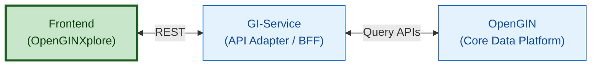

# OpenGINXplore

[](https://opensource.org/licenses/Apache-2.0) 
[](CODE_OF_CONDUCT.md)
[](SECURITY.md)
[](CONTRIBUTING.md)

OpenGINXplore is a frontend web application for exploring structured government information in a clear, discoverable, and visual way.

It provides a unified interface for navigating entities, their relationships, hierarchies, and historical changes over time, allowing users to understand how institutions, roles, and structures evolve.

OpenGINXplore consumes the [GI-Service](https://github.com/LDFLK/GI-SERVICE) (Backend-for-Frontend), which exposes [OpenGIN-based](https://github.com/LDFLK/OpenGIN) structured data through a set of tailored APIs optimized for frontend exploration and visualization.

This application serves as a sample government exploration app, using data related to the Government of Sri Lanka as a reference implementation. While the current dataset used is Sri Lanka–specific, the application is designed to be adaptable to any domain that follows the OpenGIN data model.

### Data Flow


## Features

| Feature | Description |
|--------|-------------|
| Government Structure Visualization | Enables exploration of the hierarchical structure of the Sri Lankan government, showing relationships between ministries, departments, and affiliated entities in a clear and structured manner. |
| Graph-Based Exploration | Provides an interactive, graph-based interface to visually navigate government entities and understand complex organizational relationships intuitively. |
| Data Catalog Discovery | Allows users to browse and discover datasets published by the government, ministries, and departments through a centralized data catalog. |
| Data Visualization & Yearly Comparison | Supports visualization of published datasets and comparison across multiple years to identify trends and changes over time. |
| Historical Government Information | Presents historical records of ministries, departments, and key personnel, enabling users to track structural and leadership changes over time. |

## Getting Started

### Installation & Setup

#### Prerequisite

- Node V20+
- Git

1. **Clone the Repository**

```bash
git clone https://github.com/LDFLK/openginxplore.git
cd openginxplore
```

2. **Install Dependencies**

```bash
npm install
```

3. **Configuration**

Create a `config.js` file in the `public` directory
```
// for production update the config.js file in deployment pipeline
window.configs = {
    apiUrl: "<opengin_service>",
    apiUrlData: "<bff_service>",
    feedbackFormUrl: "<feedback_form_url>",
    version: "<version>",
    dataSources: "<data_sources>"
};

// for development
window.configs = {
  apiUrl: "",
  apiUrlData: "/api",
};
```

4. **Run the Application (development)**

##### Using Terminal

```bash
npm run dev
```

The application will be available at: `http://localhost:5173`

5. **Config local proxy (React vite apps)**

If you encounter a CORS error, configure a local proxy in the `vite.config.js` file.

Update `server` block in the `vite.config.js` file.

```javascript
import { defineConfig } from 'vite'
import react from '@vitejs/plugin-react'
import path from 'path'

export default defineConfig({
    base: '/', 
    plugins: [react()],
    resolve: {
        alias: {
            '@': path.resolve(__dirname, './src'),
        },
    },
    server: {
        proxy: {
        '/v1': {
            target: 'http://localhost:8081',
            changeOrigin: true,
            secure: false,
        },
        '/api': {
            target: 'http://localhost:8000',
            changeOrigin: true,
            secure: false,
            rewrite: (path) => path.replace(/^\/api/, ''),
        },
        },
  },
})
```

## Configuration

#### Configuration Variables

Update the `config.js` file in the `public` directory

| Variable | Required | Description | Default |
|----------|----------|-------------|---------|
| `apiUrl` | `Yes` | Query (Read) OpenGIN service URL | `http://localhost:8081` |
| `apiUrlData` | `Yes` | GI-Service URL | `http://localhost:8000` |
| `feedbackFormUrl` | `No` | Feedback Form URL | `empty` |
| `version` | `No` | Application Version | `rc-1.0.0` |
| `dataSources` | `No` | Data Sources | `https://data.gov.lk/` |

## Contributing

Please see our [Contributing Guidelines](CONTRIBUTING.md).

## Code of Conduct

Please see our [Code of Conduct](CODE_OF_CONDUCT.md).

## Security

Please see our [Security Policy](SECURITY.md).

## License

This project is licensed under the Apache License 2.0 - see the [LICENSE](LICENSE) file for details.

## References

- [OpenGIN](https://github.com/LDFLK/OpenGIN) 
- [GI-Service](https://github.com/LDFLK/GI-SERVICE)
