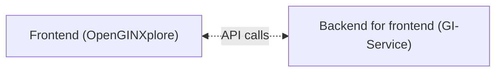

## OpenGINXplore

**A Frontend** application that calls to the [GI-Service](https://github.com/LDFLK/GI-SERVICE.git) BFF service to show the data.

### High Level Overview

### Tech Stack

- Framework: React(vite)
- Communication: REST
- Auth: None

## Installation & Setup

#### Prerequisite

- Node V20+
- Git

#### 1. Clone the Repository

```bash
git clone https://github.com/LDFLK/openginxplore.git
cd openginxplore
```

#### 2. Install Dependencies

```bash
npm install
```

#### 3. Configuration

Create a `config.js` file in the `public` directory
```
window.configs = {
  apiUrl: "<OPENGIN_BASE_URL>",
  apiUrlData: "<GI_SERVICE_BASE_URL>",
};
```

#### 4. Run the Application (development)

##### Using Terminal

```bash
npm run dev
```

The application will be available at: `http://localhost:5173`

### How to contribute?

1. Fork the repository
2. Create a feature branch: `git checkout -b feature-name`
3. Commit changes: `git commit -m 'feat: your descriptive commit message'`
4. Push to branch: `git push origin feature-name`
5. Submit a Pull Request

## Support

For support and questions:
- Create an issue in the repository
